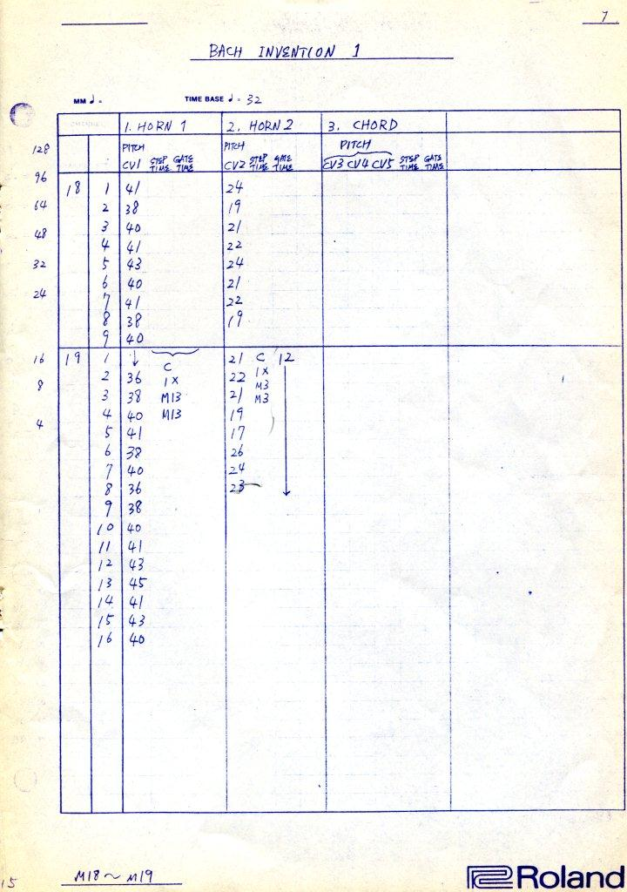

# Roland MC-8 sequencer and dump reader/writer
JS and .Net implementation for reading and playing back Roland MC-8 sequencer data dumps.  
MC-8 is using audio to save and read sequencer data on tape.

Here is great resource about MC-8 https://rolandmc8.wordpress.com/

[Roland MC-8 owner's manual](./doc/roland_mc-8_owners_manual.pdf)  
[Roland MC-8 owner's manual text](./doc/roland_mc-8_owners_manual_text.pdf)

## Blank MC-8 Program Data Sheet
Here’s a blank MC-8 program data sheet for you to print out and scribble on!

## Demo site
Currently not working because it is oooooold and web audio init fails...  
[Sequencer](https://gljubojevic.github.io/roland_mc-8_sequencer/MC-8/MC-8_Sequencer/Index.html)  
[Tracker](https://gljubojevic.github.io/roland_mc-8_sequencer/MC-8/MC-8_Sequencer/IndexTracker.html)  

## Demo sequences
All demo sequences are copied from https://rolandmc8.wordpress.com/

### Factory demo - Bach Invention
---

This is another of the demo programs provided in the Roland MC-8 manual. This time it’s a Bach Invention, 
played back on a [Roland SH-101](https://www.vintagesynth.com/roland/sh101.php) synth (not seen in the video). The first part of the video is specifically 
designed to bore you with stunning footage of me entering the channel 1 CV data for the first 3 pages of 
the 10-page score. Be thankful that I didn’t decide to include the entire CV/Step/Gate data entry process 
for the entire score. In the 2nd part of the video, you hear the entire mixed piece, played back in sync 
with the MC-8 displaying the CV data for channel 1.

Here’s an mp3 of just the music:  
<audio controls src="./demo_factory_bach_invention/bach.mp3" type="audio/mpeg">
	<a href="./demo_factory_bach_invention/bach.mp3">Download audio</a>
</audio>

And here’s the program data for anyone who might have an MC-8 to load it into:  
<audio controls src="./demo_factory_bach_invention/bach-mc8-data.mp3" type="audio/mpeg">
	<a href="./demo_factory_bach_invention/bach-mc8-data.mp3">Download audio</a>
</audio>

***Music sheets and setup***  

***Program data sheets***  

### Demo song - Odd Rhythms
---

This is one of the demo programs supplied in a supplement to the Roland MC-8 manual. It’s a piece called “Odd Rhythms,” written by the “godfather” of the MC-8, Ralph Dyck. I decided to spend a couple of hours punching this thing in to see what it sounds like. The lead, bass and chords are playing back on a [Roland SH-101](https://www.vintagesynth.com/roland/sh101.php) (overdubbed via the MC-8’s tape sync one monophonic line at a time), and the cymbal and conga are playing back on a [SCI Pro-One](http://www.vintagesynth.com/sci/seqpro1.php). For the cymbal, I had to use VCF accents instead of the VCA accents the score calls for, because the Pro-One doesn’t have a CV in for the VCA. I didn’t spend much time on the sounds or on the mix, so it is what it is. But as you can see, you can get as musically complex as you want with the MC-8.

Here’s an mp3 of just the music:

And here’s an mp3 of the MC-8 data for this piece for those of you who have an MC-8 to load it into:
